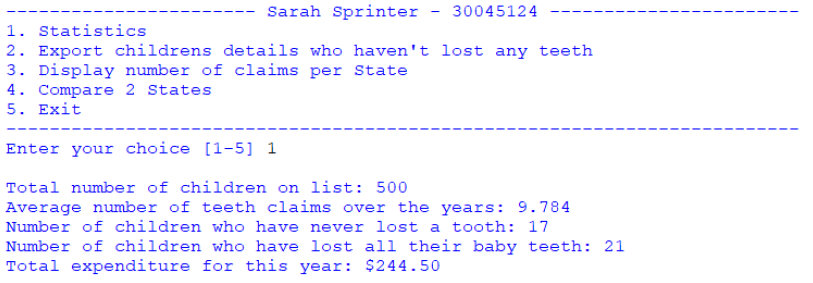
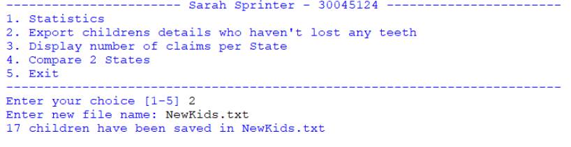
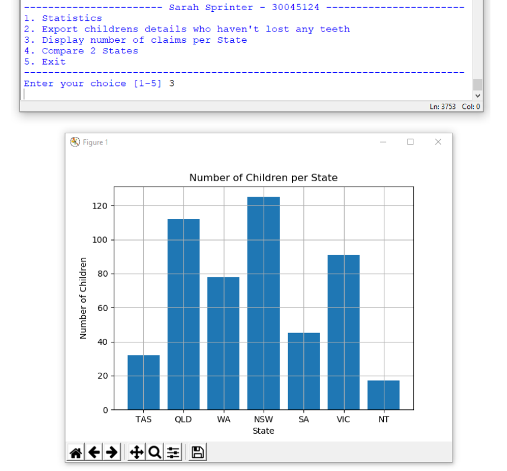
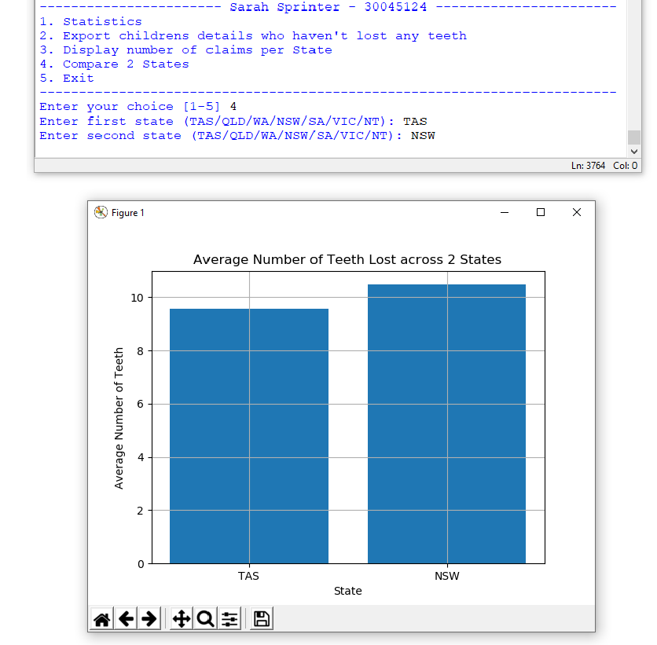

# Dental-care-analysis

**Learning Outcomes Assessed**

  The following course learning outcomes are assessed by completing this assessment:

**Knowledge:**

  K1.Identify and use the correct syntax of a common programming language.

  K2.Recall and use typical programming constructs to design and implement simple software solutions.

  K3.Reproduce and adapt commonly used basic algorithms

**Skills:**

  S1.Utilise pseudocode and/or algorithms as a major program design technique.

  S2.Write and implement a solution algorithm using basic programming constructs.

  S3.Demonstrate debugging and testing skills whilst writing code

**Application of knowledge and skills:**

  A1.Develop self-reliance and judgement in adapting algorithms to diverse contexts.

  A2.Design and write program solutions to identified problems using accepted design constructs.
  
  
 **Problem Details**
 
  You work for the Australian Tax Office (ATO) and it’s time to audit the Tooth Fairy. The Tooth   Fairy has submitted a CSV file with the details of all the tooth pickups this year (see        addresses.csv file in Moodle).
  
  **The CSV File**
  You will need to download the addresses.csv file from Moodle. The file contains 500 records across seven columns
  
 **PROGRAM**
 
 You are free to design and implement the program however you see fit. Here are some requirements that must be incorporated into your program.
 
1. You must display a welcome message when the program starts. At a minimum, this message should contain the name of your program, the name of the program developer and your student ID.

2. Your program should have a text menu that allows the user to

    a. Print the following statistics

      i. Total number of children in the text file

      ii. Average number of teeth claims over the years

      iii. Number of children who have never lost a tooth

      iv. Number of children who have lost all their baby teeth

      v. Total expenditure for this year given the following:
      
      |Number of teeth lost |Amount |
      |--- |--- |
      |0 |- |
      |1 |$1.00 |
      |More than 1 |$0.50 |
      
    b. Print to a new file, a list of children who haven’t lost any teeth. The user should be given       the chance to enter a filename.
    
    c. Display a graph showing the number of claims per State
    
    d. Display a graph comparing the overall average number of teeth lost for two given States
    
3. To help with the readability of your code, you should use functions
    

# RESULT

**OPTION 1**

**OPTION 2**

**OPTION 3**

**OPTION 4**

>Keep Smiling And Work Harder
